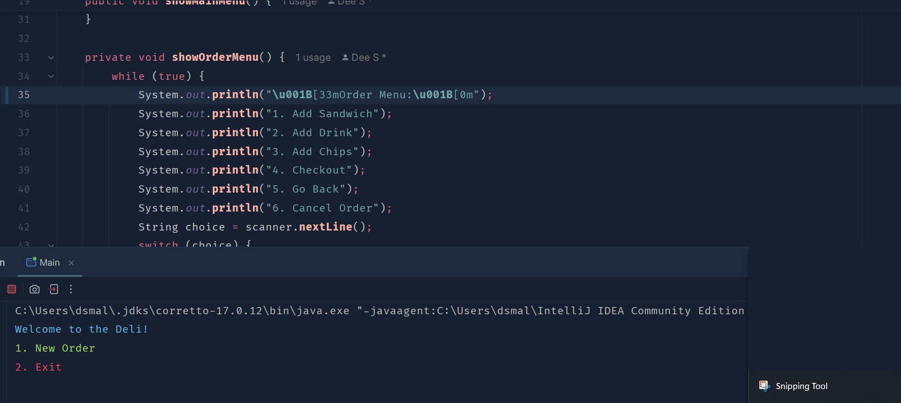
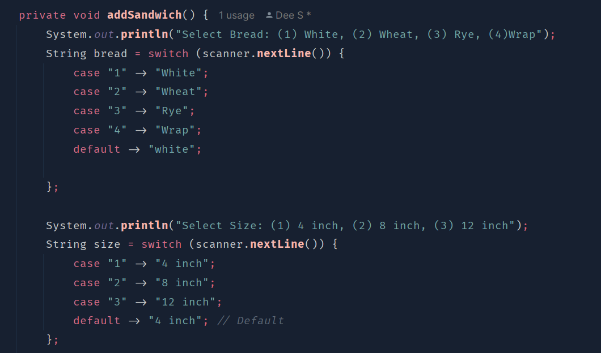
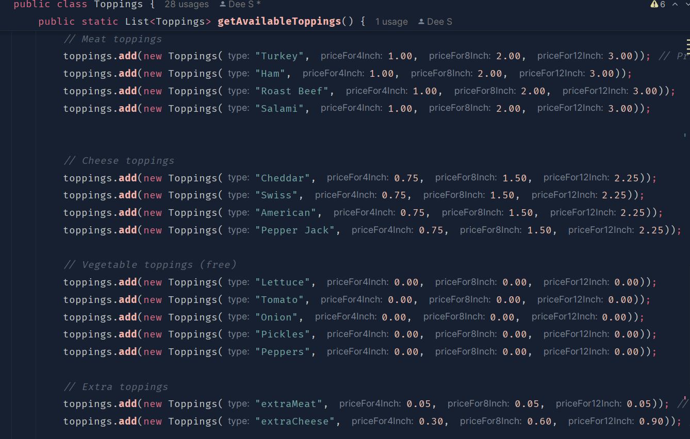

# Deli Ordering System

Welcome to the Deli Ordering System! This Java application allows users to create and manage sandwich orders easily. Users can select various options for their sandwiches, including bread types, toppings, drinks, and chips, and check out to view their total order cost.

Features:

Screenshot deli.png

-UserInterface: Simple console-based menu system for navigating orders.
-Customizable Orders: Choose from different types of bread, toppings (meats, cheeses, vegetables), drinks, and chips.
- Order Extra Toppings: Option to add extra meat or cheese for an additional cost.
- View a detailed receipt of the order at checkout.

*My fav. code in this whole system would be 
- System.out.println("\u001B[34m==============================\u001B[0m");
- System.out.println("\u001B[34m==============================\u001B[0m");
- Beacuse these are the codes that make my menu have colors!

Technologies Used:

- Java (JDK 11 or higher)
- Basic console input and output

- 
- 
- 